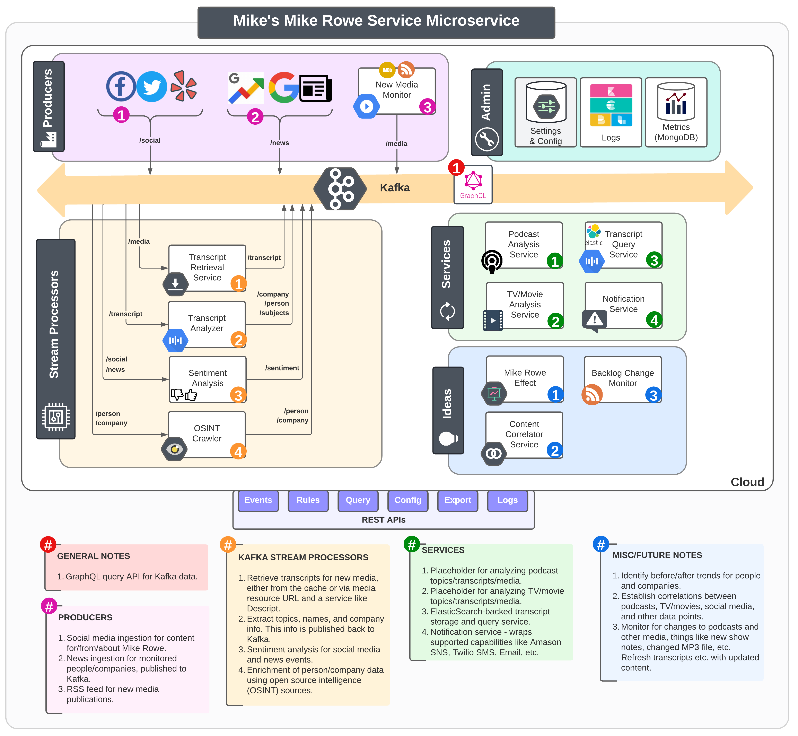

<h1 align="center">👷‍ Mike's Mike Rowe Service Microservice 👷‍</h1>

<p align="center">

</p>

<h3 align="center">In order to learn more about microservices, I figured... <br>What better way than with a <em>Mike Rowe Service</em>? <br><br>🙊😜</h3>

# Overview
A demo/sample project using Spring Boot, Kafka, REST, SQL, NoSQL, GraphQL, Gradle multimodule builds, etc., 
in a microservice architecture.

**This is not affiliated with Mike Rowe, Dirty Jobs, 'The Way I Heard It', or any other Mike-Rowe-based entity/product in ANY way.** 

## 🚨 Setting Expectations 🚨

1. 🤓 This repo and its contents exist solely for the purpose of 🔬🧠 learning/playing with a few technologies and concepts (in no particular order): 
   1. [Microservice Architecture](https://microservices.io) (see: [Architecture](#-architecture))
   2. [Spring Boot](https://docs.spring.io/spring-boot/docs/current/reference/htmlsingle/) (throughout)
   3. [REST APIs](https://en.wikipedia.org/wiki/Representational_state_transfer) (see: [Client API](#-client-api-))
   4. [SQL](https://en.wikipedia.org/wiki/SQL) with Spring Boot JPA (details TBD, maybe Postgres? Might also remove this module.) 
   5. [NoSQL](https://en.wikipedia.org/wiki/NoSQL) (in this case, [MongoDB](https://www.mongodb.com))
   6. [GraphQL](https://www.graphql-java.com) (see: [GraphQL Adapter](#-graphql-adapter))
   7. [Elasticsearch](https://www.elastic.co) (see: [Transcript Service](#-transcript-service))
   8. [Kafka (Streams)](https://kafka.apache.org/documentation/streams/) (see: [Sentiment Analysis Stream Processor](#-sentiment-analysis-stream-processor))
   9. [a monorepo](https://en.wikipedia.org/wiki/Monorepo)
   10. [gradle multimodule builds](https://reflectoring.io/spring-boot-gradle-multi-module/), and more.
2. 🚧 This is ***nowhere near complete*** – not even in the "do an end-to-end 'hello world' test" sense.
3. 🐣 There is no plan to fully implement each of the modules/services. 
4. 🥸 Data will be canned and mocked in most cases.
5. 🐳 For now, this uses `docker-compose` 
   1. There is a tentative future plan to deploy this with K8s since I'd like to get more hands-on with that too, but no ETA on that.
6. 🚨 This was created to learn about these technologies/concepts. ⚠️ **DO NOT consider this as a reference for how to do anything the "right" way!** ⚠️
7. 🙈 Apologies in advance for the lack of tests and javadocs, I plan to add both. The plan was to get an outline with stubbed modules in place first.
8. 👋 Please don't hesitate to reach out with suggestions etc.

Essentially, having lacked any production microservice experience prior to this repo's inception, 
I wanted a "playground" in which to explore/learn a bunch of concepts and technologies.

## 🛠👷🏻🧱 Architecture

This is my "thinking out loud" diagram for what this could look like.

There are several notes embedded in the diagram which describe nuances, considerations, or theoretical "what if" ideas.



## 🕓 Timestamps

All timestamps are either [unix epoch millis](https://en.wikipedia.org/wiki/Unix_time)
([converter](https://www.epochconverter.com)) (as stated by variable/field name) or
[ISO-8601 (ex: 2012-04-23T18:25:43.511Z)](http://en.wikipedia.org/wiki/ISO_8601).

## 📂 Directory Structure

```
├── README.md
├── build.gradle
├── client-api
├── doc
│   └── architecture-summary.png
├── docker
│   └── mapped-volumes
├── docker-compose.yml
├── libs
│   ├── db-adapter (might be removed)
│   ├── graphql-adapter
│   ├── kafka-adapter
│   ├── model
│   └── mongo-adapter
├── services
│   ├── imdb-service
│   ├── notification-service
│   ├── podcast-service
│   ├── transcript-service
│   └── twitter-service
├── settings.gradle
└── stream-processors
    └── sentiment-processor

```

# 🧑‍💻 Client API 🧑‍💻

There is a client API that is the "main" REST API for accessing this Mike Rowe "Service" backend.

The exact endpoints are TBD for now, but some ideas include:
* Get the link to the latest podcast that mentions `<topic>`.
* Retrieve the last tweet from Mike that has more than `<#>` likes.
* Get the highest rated episode of *Dirty Jobs* since `<date>`.

When deployed locally, the endpoints will be exposed at: [localhost:8080/api/query]().

☝️ **TIP**: You can discover the defined endpoints with the following command:

```shell
egrep -R --include "*.java" '@RequestMapping|@GetMapping|@PostMapping|@PutMapping|@PatchMapping|@DeleteMapping' 
```

<h1 align="center">📚 Libraries 📚</h1>

## 📀 Data Model

This library contains POJO structures that serve as a common data model between services.

```groovy
api project(":model")
```

The original intent was to use JSON schema to define the beans and generate the POJOs as part of the
build, however that is not included in the initial pass. 

The (tentative) plan was to use [jsonschema2dataclass/js2d-gradle](https://github.com/jsonschema2dataclass/js2d-gradle).

## 🧩 MongoDB Adapter

**This includes the `Data Model` library.**

```groovy
api project(":mongo-adapter")
```

An API wrapper around a MongoDB to make it easier for services to use MongoDB without implementing a database
instance. This would also make it much easier to replace Mongo with an alternative solution at some point.


## 🦦 Kafka Adapter 

**This includes the `Data Model` library.**

Services can include this with:
```groovy
api project(":kafka-adapter")
```

This is a library that makes it exceedingly easy to integrate with Kafka or Kafka Streams as a publisher or 
receiver of Kafka data.

### Kafka Topics

Kafka topics are defined centrally in `libs/kafka-adapter/src/main/resources/application.properties`. For example: 

```properties
#
# Topics
#
kafka.topic.notification=notification
kafka.topic.sentiment=sentiment
kafka.topic.podcast=podcast
kafka.topic.video=video
kafka.topic.news=news
kafka.topic.social=social
kafka.topic.social.twitter=twitter
kafka.topic.social.facebook=facebook
```


## 📈 GraphQL Adapter

**This includes the `Data Model` and `MongoDB Adapter` libraries.**

```groovy
api project(":graphql-adapter")
```

There are numerous resources for [GraphQL with Java](https://www.graphql-java.com/tutorials/getting-started-with-spring-boot/) 
and Spring Boot. It seems as though I approach this at an inflection point between pre-official-Spring-Boot-GraphQL and post. 
Right now, it requires a pre-release version of Spring Boot to use. At the time of writing, I have opted for the "old" approach.

TODO: Integrate this to use the data model's POJOs: https://github.com/graphql-java-kickstart/graphql-java-tools

This project does leverage the kickstart library's suite of tools/capabilities, specifically [graphql-java-kickstart/graphql-spring-boot](https://github.com/graphql-java-kickstart/graphql-spring-boot).
For more information, check out the [GraphQL Java Kickstart (Spring Boot)](https://www.graphql-java-kickstart.com/spring-boot/) documentation.

More useful guides can be found on [codingconcepts.com](https://codingnconcepts.com/spring-boot/build-graphql-api-with-spring-boot/)

The official [GraphQL Schema resources](https://graphql.org/learn/schema) are really useful.

The GraphQL Schema is defined in: `libs/graphql-adapter/src/main/resources/schema.graphqls`. This schema defines the
data structures and query API for the GraphQL functionality.

For example:

```graphql
type Query {
  latestPodcastMentioningTopic(topic: String!): PodcastEpisode
  mostPopularPodcastTopics(numMostPopular: Int): TopicList
  podcastTranscriptByEpisodeNumber(episodeNumber: Int!): Transcript
  podcastByEpisodeNumber(episodeNumber: Int!): PodcastEpisode
  televisionTranscript(showName: String!, seriesNumber: Int!, episodeNumber: Int!): Transcript
  televisionEpisode(showName: String!, seriesNumber: Int!, episodeNumber: Int!): TelevisionEpisode
  mostPopularTelevisionEpisode(showName: String!, seriesNumber: Int): TelevisionEpisode
  mostPopularTweetSince(numDays: Int): SocialMediaPost
  mostRecentTweetWithNumLikes(numLikes: Int): SocialMediaPost
  mostPopularSocialMediaPostSince(numDays: Int): SocialMediaPost
  mostPopularMovies(numMovies: Int): [Movie!]
}
```

### GraphQL Libraries

There are 3 primary choices, and things are especially confusing with Spring Boot's GraphQL starter being in a pre-release
phase at the time of writing. I won't summarize it here, but there are some great resources to cover the library options – 
I especially liked [this one](https://medium.com/springboot-chronicles/graphql-in-springboot-a-comparative-study-among-the-libraries-and-their-implementation-know-how-b0e8d544f2fc) 
by [Soham Dasgupta](https://twitter.com/iamsoham). 
[This one from codingconcepts.com](https://codingnconcepts.com/spring-boot/build-graphql-api-with-spring-boot/) is also helpful.

* [graphql-java](https://github.com/graphql-java/graphql-java) ([How to GraphQL](https://www.howtographql.com/advanced/1-server/))
* [graphql-java-kickstart](https://github.com/graphql-java-kickstart) ([GraphQL Java Kickstart Guide]())
* [netflix-graphql-dgs](https://github.com/netflix/dgs-framework/) ([Getting Started](https://netflix.github.io/dgs/getting-started/))

### Schema-First

I have decided to take a "schema-first" approach, which means defining the `.graphqls` first and then generating POJOs 
from this schema. 

For POJO generation, this project uses the [graphql-java-generator/graphql-gradle-plugin-project](https://github.com/graphql-java-generator/graphql-gradle-plugin-project) gradle plugin. 
The [Getting Started Guide](https://github.com/graphql-java-generator/GraphQL-Forum-Gradle-Tutorial-server) is also worth review.


<h1 align="center">🧠 Modules and Services 🧠</h1>

These are services which process incoming data and requests in various ways in order to produce results, filter data, generate transcripts, and more.

## 🎬 Movies and TV Service (IMDB Service)

Retrieves data about TV and movies. 

This was called the "IMDB" service, but is likely going to use more "open" 
alternatives like [The Movie Database (TMDB)](https://developers.themoviedb.org) or 
[Open Movie Database (OMDB)](http://www.omdbapi.com).

## 📧 Notification Service

Based on the current rules/configuration, publish notifications for certain events.

For example, send a push notification or SMS each time a podcast episode is posted or each time any 
of Mike Rowe's content mentions the state of Colorado.

Right now, this is a placeholder. Eventually this could just be the service interface for several services behind
a curtain, things like [Twilio](https://twilio.com) (SMS), [Email (... maybe?)](https://www.baeldung.com/spring-email), 
[IFTTT](https://ifttt.com), [SimplePush](https://simplepush.io), [AWS SNS](https://aws.amazon.com/sns/), and others.


## 🎧 Podcast Service

Retrieves episodes of Mike Rowe's podcast [The Way I Heard It](https://mikerowe.com/podcast/).

Uses RSS processing with the [Feed Adapter Spring Integration](https://docs.spring.io/spring-integration/reference/html/feed.html) 
(which uses [ROME](https://rometools.github.io/rome/) under the hood).

Feeds media to the `Transcript Service` where a transcript does not yet exist in the cache.

Brainstorm: extract topics, people, etc. and queue up OSINT "jobs" on each.


## 💬 Transcript Service

Retrieves existing transcripts or fetches them using a service like [Descript](https://www.descript.com). 
Note that right now, this just generates mock data in lieu of actually integrating with [Descript](https://www.descript.com) 
or similar.

Uses ElasticSearch to store transcripts.

### 📝 Development Note

To start a simple ElasticSearch container (stand-alone, independent of this project):
```shell
docker run -d --name elasticsearch -p 9200:9200 -e "discovery.type=single-node" elasticsearch:7.6.2
```

## 🐥 Twitter Service

This ia a service which leverages the [Twitter4J](https://twitter4j.org/en/index.html) library to 
monitor [Mike Rowe's Twitter account](https://twitter.com/mikeroweworks) as well as topics related 
to Mike Rowe. Data is ingested and published to a Kafka topic.

Monitored topics can be configured in the properties file for this service.

<h1 align="center"> 🦦 Kafka Stream Processors 🦦</h1>

Stream processors use [Kafka Streams](https://kafka.apache.org/documentation/streams/) to process data.

## 👍👎 Sentiment Analysis Stream Processor

Placeholder/future.

The general idea is creating a Kafka Stream processor that takes content that mentions Mike Rowe and generate
a sentiment score.


<h1 align="center">✅ Key Items on TODO List ✅</h1>

The "TODO" list here is endless, but a few focal points include:
* Create the Kafka adapter and remove redundant code from various modules.
* Figure out how to share `properties` files, right now each module has `application.properties` of its own.
  * Lots of resources for this one, including:
    * [Spring Boot Docs - Externalized Configuration](https://docs.spring.io/spring-boot/docs/current/reference/html/features.html#features.external-config)
    * [StackOverflow](https://stackoverflow.com/questions/35663679/spring-boot-inherit-application-properties-from-dependency)
    * [Baeldung - Properties with Spring and Spring Boot](https://www.baeldung.com/properties-with-spring)
* Testcontainers setup ([example](https://nirajsonawane.github.io/2019/12/25/Testcontainers-With-Spring-Boot-For-Integration-Testing/))
* Use Secrets to capture things like the Twitter API tokens.

<!---
Admin Notes:

* I am using HTML syntax in a few places for centered text/images... I know it's more of a pain by breaking 
the `#` rendering of some tools. Sorry!
--->